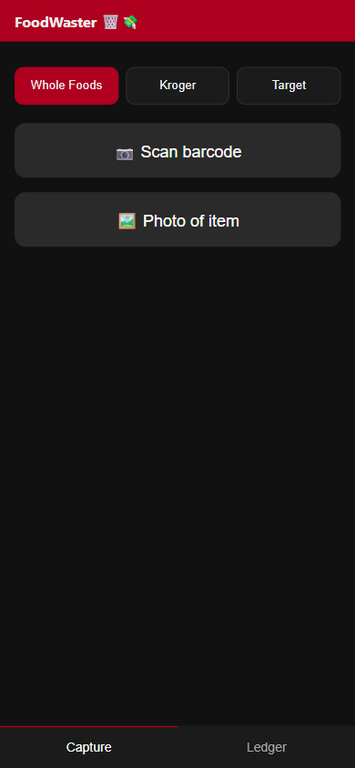
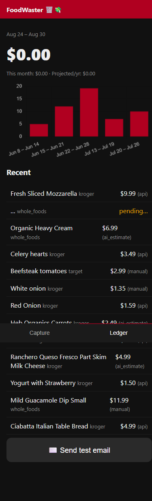
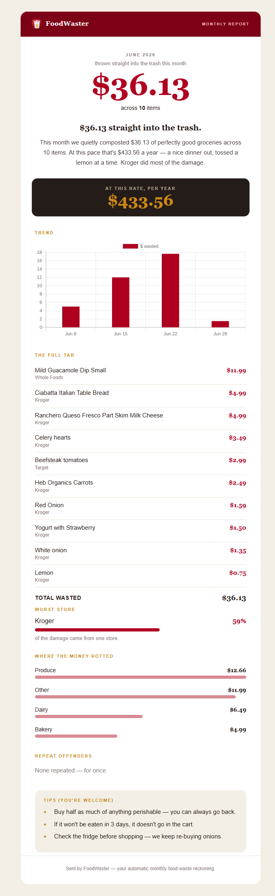
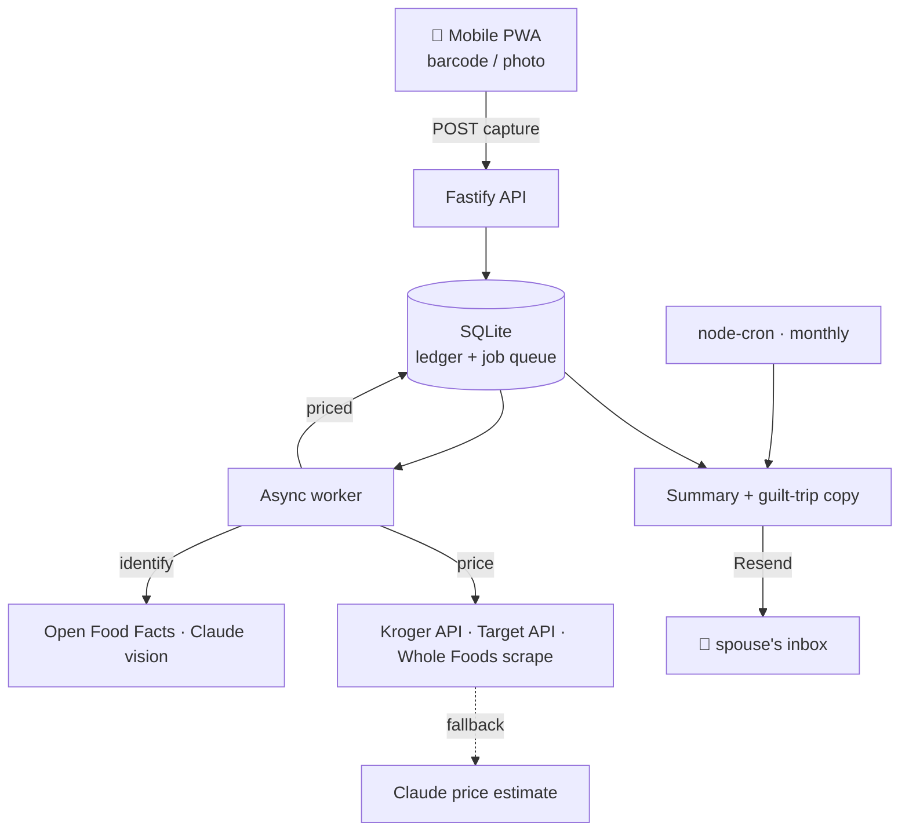

<div align="center">


# FoodWaster 🗑️💸

**Scan the groceries you throw away. Get the dollar figure. Guilt-trip accordingly.**

A mobile-first PWA that turns rotting produce into a number your household can't ignore.
Scan a barcode (or snap a photo), it identifies the item and prices it at your grocer,
logs the waste, and emails a monthly "here's what you binned" report.

</div>

---

## The idea

My wife buys nice groceries and lets a fair amount of it quietly die in the fridge. Words
didn't land; **dollars** do. So this app makes the waste concrete: point your phone at the
thing before it hits the trash, and once a month it mails an itemized reckoning.

Built end to end — spec, code, tests, and deploy — as a vibecoding project with
[Claude Code](https://claude.com/claude-code).

## What it does

- 📷 **Fast capture** — live barcode scanning (with a sweeping scan-line overlay) or a photo of loose produce. Fire-and-forget; items land as `pending`.
- 🧠 **AI identify + real prices** — barcode → Open Food Facts, photo → Claude vision. Price resolves async via the **Kroger** API, **Target** API, and **Whole Foods** (scrape), falling back to a grocer-aware **Claude estimate**.
- 📒 **Running ledger** — totals, projected annual burn, trend chart, category & worst-store breakdowns, repeat offenders. Tap any row to edit the name/price or delete it.
- ✉️ **Monthly guilt-trip email** — a polished HTML report (itemized "full tab", trend chart, tips) auto-sent on the 1st via Resend. Never sends an empty $0 report.
- 📱 **Installable** — add to home screen, custom icon, full-screen, works offline-ish.

## Screenshots

| Capture | Ledger | Monthly email |
|---|---|---|
|  |  |  |

## How it works



One always-on box runs everything: the API, the static PWA, the worker, and the cron.

## Tech stack

TypeScript · Fastify · **built-in `node:sqlite`** (zero native deps) · Vitest · Playwright
(Whole Foods scrape) · node-cron · Resend · Anthropic Claude · QuickChart · vanilla PWA
(no frontend framework). ~100 tests, deployed on Fly.io (~$3–4/mo).

## Run it locally

Requires **Node ≥ 22** (for the built-in `node:sqlite` module).

```bash
git clone https://github.com/<you>/foodwaster.git
cd foodwaster
npm install
npx playwright install chromium   # only needed for the Whole Foods scrape
cp .env.example .env              # fill in the values below
npm run dev                       # http://localhost:8080
```

Open the URL, enter your `APP_PASSCODE`, and you're in. Camera capture needs HTTPS, so
barcode/photo scanning works once deployed (or via a tunnel like `npx localtunnel --port 8080`).

```bash
npm test        # run the test suite
npm run build   # compile to dist/
```

### Configuration (`.env`)

| Variable | Required | What it is |
|---|:---:|---|
| `APP_PASSCODE` | ✅ | Code to unlock the app |
| `WIFE_EMAIL` | ✅ | Where the monthly report goes |
| `EMAIL_FROM` | ✅ | Sender, e.g. `FoodWaster <bot@yourdomain.com>` (verified in Resend) |
| `ANTHROPIC_API_KEY` | ✅ | Photo ID, price estimates, email copy |
| `RESEND_API_KEY` | ✅ | Sends the email |
| `KROGER_CLIENT_ID` / `_SECRET` / `_LOCATION_ID` | – | Real Kroger prices |
| `TARGET_STORE_ID` / `TARGET_API_KEY` | – | Real Target prices |
| `WHOLE_FOODS_SCRAPE` | – | `true` to enable the Playwright scrape (off by default → AI estimate) |

Leave any grocer blank to skip it — that grocer falls back to an AI price estimate.
Full walkthrough for obtaining each key + deploying to Fly/Render/Railway is in
[`SETUP.md`](SETUP.md).

## Deploy

Ship it to any always-on host with a persistent disk. The repo includes a `Dockerfile`,
a `fly.toml` (Fly.io — cheapest), and a `render.yaml`. See [`SETUP.md`](SETUP.md).

---

<div align="center"><sub>Built with Claude Code. No groceries were harmed in the making of this README.</sub></div>
